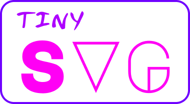

</img>
# Tiny SVG
A tiny SVG library for drawing and quick experiments. No dependencies. 

### Quick example
```d
SVGCanvas canvas = SVGCanvas(240, 240);

// add gradient
new RadialGradient("rg0", Colors.gold, Colors.orange)
    .setOpacityA(0.4)
    .setOpacityB(0.9)
    .addToCanvas(canvas);

// draw
new Rectangle(0, 0, canvas.width, canvas.height)
    .setStrokeColor(Colors.blue)
    .setStrokeWidth(0)
    .setGradient("rg0")
    .addToCanvas(canvas);

new Circle(canvas.width / 3, canvas.height / 3, 24)
    .setFillColor(Colors.white)
    .addToCanvas(canvas);

new Circle(canvas.width * 2 / 3, canvas.height / 3, 24)
    .setFillColor(Colors.white)
    .addToCanvas(canvas);

new Curve(canvas.width / 3, canvas.height * 2 / 3, canvas.width * 2 / 3, canvas.height * 2 / 3)
    .setFillColor(Colors.white)
    .addToCanvas(canvas);

// save
canvas.save("examples/example.svg");
```

Output:


### Example (origami bird)


Code can be found [here](source/app.d).